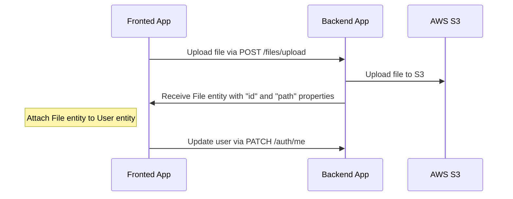

# File uploading

---

## Table of Contents <!-- omit in toc -->

- [File uploading](#file-uploading)
  - [Uploading and attach file flow for `s3` driver](#uploading-and-attach-file-flow-for-s3-driver)
    - [Configuration for `s3` driver](#configuration-for-s3-driver)
    - [An example of uploading an avatar to a user profile (S3)](#an-example-of-uploading-an-avatar-to-a-user-profile-s3)
  - [How to delete files?](#how-to-delete-files)

---

## Uploading and attach file flow for `s3` driver

Endpoint `/files/upload` is used for uploading files, which returns `File` entity with `id` and `path`. After receiving `File` entity you can attach this to another entity.

### Configuration for `s3` driver

1. Open https://s3.console.aws.amazon.com/s3/buckets
1. Click "Create bucket"
1. Create bucket (for example, `your-unique-bucket-name`)
1. Open your bucket
1. Click "Permissions" tab
1. Find "Cross-origin resource sharing (CORS)" section
1. Click "Edit"
1. Paste the following configuration

    ```json
    [
      {
        "AllowedHeaders": ["*"],
        "AllowedMethods": ["GET"],
        "AllowedOrigins": ["*"],
        "ExposeHeaders": []
      }
    ]
    ```

1. Click "Save changes"
1. Update `.env` file with the following variables:

    ```dotenv
    AWS_ACCESS_KEY=YOUR_ACCESS_KEY_ID
    AWS_S3_SECRET_KEY=YOUR_SECRET_ACCESS_KEY
    AWS_DEFAULT_S3_REGION=YOUR_AWS_S3_REGION
    AWS_DEFAULT_S3_BUCKET=YOUR_AWS_DEFAULT_S3_BUCKET
    ```

### An example of uploading an avatar to a user profile (S3)



## How to delete files?

We prefer not to delete files, as this may have negative experience during restoring data. Also for this reason we also use [Soft-Delete](https://orkhan.gitbook.io/typeorm/docs/delete-query-builder#soft-delete) approach in database. However, if you need to delete files you can create your own handler, cronjob, etc.

---

Previous: [Auth](auth.md)

Next: [Tests](tests.md)
